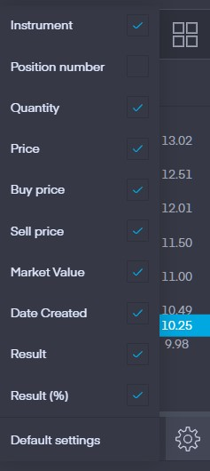

# trading212_scraper
Python based web scraping using selenium for extracting current portfolio holdings.

- Currently only support Edge driver
- Supports Python2.7 / Python3.1+

## Pre-requisites

```
$> pip install selenium
$> pip install msedge-selenium-tools
```

## Setup
Make sure the following show tabs setting are checked, and that 2 Factor-Authenication is disabled.



## How to clone
    git clone https://github.com/dhanoosu/trading212_scraper.git

## Usage

```python
from src.trading212_scraper import Scrape
```

Initialise a new class object, parsing in your username and password.
`headless=True` allows the active window to be run in background.

```python
trading212 = Scrape(
  username = <YOUR_USERNAME>,
  password = <YOUR_PASSWORD>,
  headless = <True/False>
)

trading212.setup()

trading212.scrape(account=<"ISA"/"INVESTING">)

account_summary = trading212.get_account_summary()
stocks = trading212.get_stocks()

#Gracefully close driver
trading212.close_driver()

```
